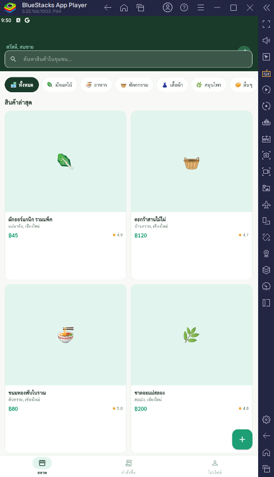
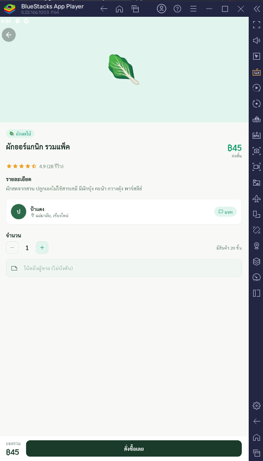
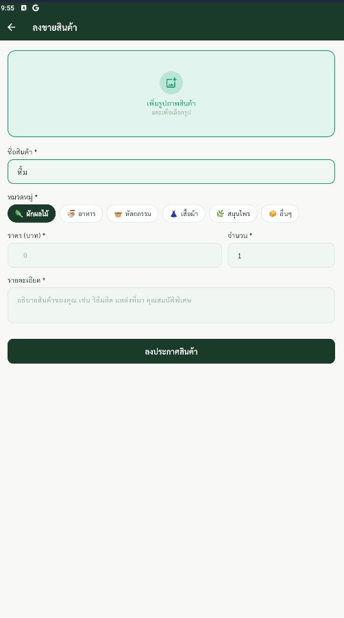
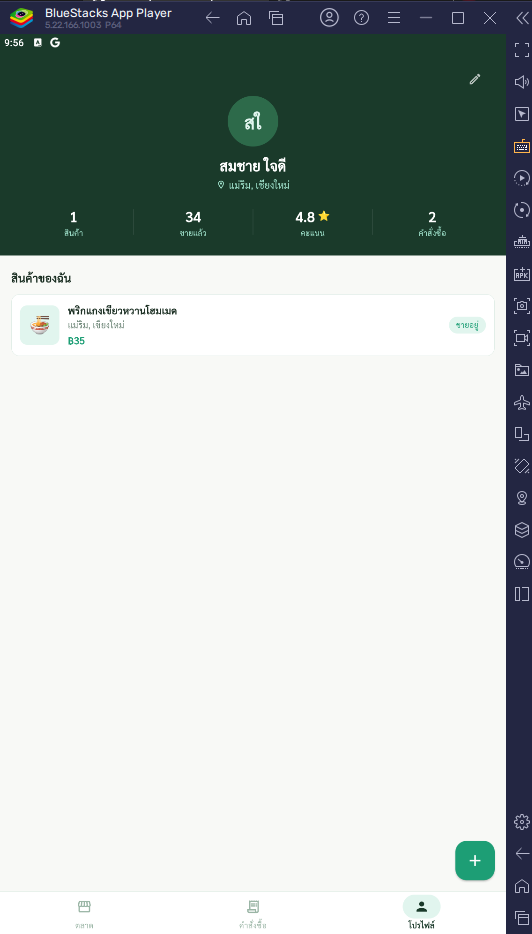

# ตลาดชุมชน (Community Market)
---
## Pawaris Koonsri 67543210037-7
---
<p align="center">
  
</p>

<p align="center">
  <strong>แพลตฟอร์มซื้อ-ขายสินค้าในชุมชนท้องถิ่น</strong><br/>
  เชื่อมเกษตรกร ผู้ผลิต และช่างฝีมือกับผู้บริโภคในพื้นที่
</p>

---

## จุดประสงค์ของแอป

**ตลาดชุมชน** คือแอปพลิเคชันที่ช่วยให้คนในชุมชนสามารถ:
- **ผู้ขาย** — ลงขายสินค้าที่ผลิตเองได้ง่าย เช่น ผักออร์แกนิก ของหัตถกรรม อาหารโฮมเมด
- **ผู้ซื้อ** — ค้นหาและสั่งซื้อสินค้าจากคนในชุมชนเดียวกัน ลดการพึ่งพาคนกลาง
- **ชุมชน** — เสริมสร้างเศรษฐกิจฐานราก เพิ่มรายได้ให้คนในท้องถิ่น

---

## ฟีเจอร์หลัก

| ฟีเจอร์ | รายละเอียด |
|---------|-----------|
| 🏪 ตลาดสินค้า | เรียกดูสินค้าทั้งหมด กรองตาม 6 หมวดหมู่ |
| 🔍 ค้นหา | ค้นหาสินค้าจากชื่อหรือรายละเอียด |
| 📦 ลงขายสินค้า | เพิ่มรูปจากกล้อง/แกลเลอรี่ ตั้งราคาและจำนวน |
| 🛒 สั่งซื้อ | เลือกจำนวน ส่งโน้ตถึงผู้ขาย สั่งซื้อในแอป |
| 📋 ติดตามออเดอร์ | ดูสถานะคำสั่งซื้อ แบ่งเป็น 3 แท็บ |
| 👤 โปรไฟล์ | จัดการข้อมูลส่วนตัว ดูสินค้าและสถิติของตัวเอง |

### หมวดหมู่สินค้า
🥬 ผักผลไม้ · 🍜 อาหาร · 🧺 หัตถกรรม · 👗 เสื้อผ้า · 🌿 สมุนไพร · 📦 อื่นๆ

---

## รายละเอียดทางเทคนิค

**Framework:** Flutter 3.x (Dart)

**Architecture:** Provider Pattern + Repository Pattern

**Local Database:** SQLite ผ่าน `sqflite`

**State Management:** `provider`

**Dependencies หลัก:**
```yaml
provider: ^6.1.1        # State management
sqflite: ^2.3.2         # Local database
image_picker: ^1.0.7    # Camera & gallery
google_fonts: ^6.2.1    # Typography
uuid: ^4.3.3            # ID generation
intl: ^0.19.0           # Date formatting
```

**โครงสร้างโปรเจกต์:**
```
lib/
├── main.dart
├── app.dart                    # Bottom navigation
├── models/                     # Data models
│   ├── product.dart
│   ├── order.dart
│   └── user.dart
├── services/
│   ├── database_service.dart   # SQLite CRUD operations
│   └── product_provider.dart   # App state management
├── screens/
│   ├── home_screen.dart
│   ├── product_detail_screen.dart
│   ├── add_product_screen.dart
│   ├── orders_screen.dart
│   └── profile_screen.dart
├── widgets/
│   └── common_widgets.dart     # Reusable UI components
└── utils/
    └── app_theme.dart          # Design system & constants
```

---

## วิธีติดตั้งและรัน

### ความต้องการของระบบ
- Flutter SDK >= 3.0.0
- Dart SDK >= 3.0.0
- Android SDK (API 21+)
- Java 11+

### ขั้นตอน

```bash
# 1. Clone โปรเจกต์
git clone https://github.com/PeawZaZa/community-market.git
cd community-market

# 2. ติดตั้ง dependencies
flutter pub get

# 3. รันในโหมด debug
flutter run

# 4. Build APK (Release)
flutter build apk --release
# ไฟล์ APK จะอยู่ที่: build/app/outputs/flutter-apk/app-release.apk

# 5. Build APK แบบแยกตาม ABI (ขนาดเล็กลง)
flutter build apk --split-per-abi
```

---

## ภาพหน้าจอแอป

| หน้าตลาด | รายละเอียดสินค้า | ลงขายสินค้า | โปรไฟล์ |
|---------|----------------|------------|--------|
|  <br>หน้าแรก ค้นหา กรองหมวดหมู่ |<br> ดูข้อมูล สั่งซื้อ ติดต่อผู้ขาย | <br>เพิ่มรูป กำหนดราคา จำนวนสต็อก | <br>สถิติ สินค้าของฉัน แก้ไขข้อมูล |

---

## ข้อมูลแอป

- **ชื่อแอป:** ตลาดชุมชน (Community Market)
- **เวอร์ชัน:** 1.0.0
- **Platform:** Android (iOS พร้อมรองรับ)
- **ภาษา:** ไทย
- **กลุ่มเป้าหมาย:** ชุมชนเกษตรกรและผู้ผลิตในท้องถิ่น โดยเฉพาะพื้นที่เชียงใหม่

---

## License

Pawaris Koonsri
